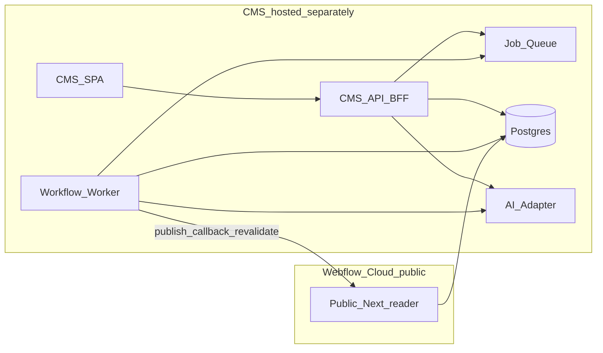
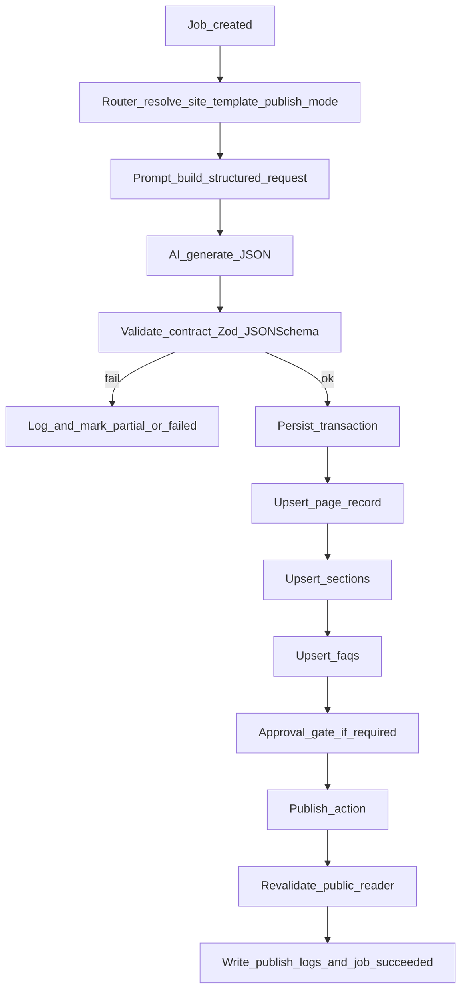

# Multi-Site AI-Assisted SEO CMS and Publishing Platform — Architecture Blueprint

This document defines product architecture, repositories, data model, CMS surfaces, workflow engine, APIs, deployment, and technology choices for a **real** build. It is intentionally **site-agnostic**: MCA Loan is **site_id = first tenant**, not a hardcoded product name in code paths.

---

## A. Product architecture

### A.1 System map (logical services)

| Service | Responsibility | Notes |
|--------|------------------|-------|
| **CMS Web App** | Admin UI, auth, configuration, content editing, job creation, observability | Hosts the GUI; calls internal API only |
| **CMS API (BFF)** | CRUD for sites/pages/sections/faqs/jobs, orchestration hooks, signed preview tokens | Single backend surface for the CMS SPA |
| **Workflow Engine (Worker)** | Executes jobs: route → prompt → AI → validate → persist → publish → log | **Same codebase repo** as API, different process/role |
| **Job Queue + Store** | Durable jobs, retries, concurrency, dead-letter, progress | Postgres-backed (recommended) or Redis+Postgres hybrid |
| **Database (Postgres)** | Source of truth for content + ops + tenancy | Multi-tenant from day one (`site_id` on nearly all rows) |
| **Object storage (optional)** | Media, exports, large raw AI payloads | S3/R2; keep DB lean |
| **AI Provider Adapter** | Claude/OpenAI/etc behind one interface | Swap models without touching workflows |
| **Public Web App (Reader)** | SSR/ISR pages, SEO metadata, sitemap, robots, **published-only** reads | Deployed on **Webflow Cloud** for MCA domain |
| **Edge secrets / tokens** | Revalidation, internal publish callbacks | Short-lived secrets, rotation |



### A.2 Core principle: two applications, one content database (recommended)

**Option you described (recommended baseline):** CMS + worker share Postgres with the public app **read path** for published rows.

- **CMS/worker** write: drafts, sections, faqs, jobs, logs, approvals.
- **Public app** read: `published` + `approved_publish` snapshot or `published_version` pointer (see data model) with aggressive caching.

**Alternative (stronger isolation):** “Publish projection” — worker writes to a **read-optimized publish store** (second schema or second DB) that public app reads only. Adds complexity; use if you need hard air gaps.

**Recommendation for v1:** Single Postgres, **schemas**: `cms` (ops), `content` (canonical), optional `public_cache` materialized views. Public app uses **read-only** DB role + row-level filters.

### A.3 Tenancy model (multi-site)

Everything user-facing in CMS is scoped by **`site_id`**.

- Sites have domains, brand tokens, prompt packs, template registry, and allowed page groups.
- Pages, sections, FAQs, keywords, jobs, logs all carry `site_id`.
- Super-admin can manage all sites; site-admin role limited to one site.

---

## B. Repo strategy

### B.1 Recommendation: **monorepo** (TypeScript-first)

**Why:** CMS UI, API, worker, shared types, template contracts, validators, and the public reader share one **schema of truth** (Zod/JSON Schema). Claude-assisted development benefits enormously from shared packages.

Suggested layout:

```text
/apps
  /cms-web          # Admin SPA (Vite+React or Next admin routes)
  /cms-api          # HTTP API + auth + webhooks entry
  /worker           # Job consumer (same deploy unit optional)
  /public-reader    # Webflow Cloud deploy target (published-only)
/packages
  /db               # Drizzle/Prisma schema, migrations
  /contracts        # Template contracts, section keys, publish modes
  /ai               # Prompt builders, model adapters
  /validation       # Strict validators for AI JSON
  /shared           # Types, errors, pagination, money formatting
/tooling
  eslint, tsconfig, turbo/pnpm
```

### B.2 Public app separation while staying reusable

- **`apps/public-reader`**: minimal surface: routes, rendering, SEO, fetch published content.
- **`apps/cms-web` + apps/cms-api`**: full platform.
- **Contract package** [`packages/contracts`](packages/contracts): consumed by CMS, worker, and optionally public reader (for compile-time route safety).

### B.3 Webflow Cloud constraint

Webflow Cloud should deploy **only** `public-reader` (or a slim export of it). Monorepo still works: CI builds artifact from `apps/public-reader` and uploads.

**Do not** embed CMS routes in the public deploy target.

---

## C. Data model (Postgres-first)

### C.1 Identity and access

- **`users`**, **`sessions`**, **`roles`**, **`site_memberships`**
- Optional: **`api_keys`** for machine access (rotate, scope by site)

### C.2 `sites`

- `id`, `name`, `slug` (internal), `primary_domain`, `default_locale`
- `brand`: JSON (colors, typography tokens optional)
- `seo`: `title_suffix`, `default_og_image_url`, `hreflang_policy` (future)
- `settings`: JSON (feature flags, rate limits)
- `status`: active/suspended

### C.3 `templates` (registry, not HTML blobs)

Per site (or global template library + site overrides):

- `id`, `site_id` nullable if global
- `key`: `type|sector|guide|comparison|faq|use_case`
- `version` (semver int), `required_section_keys` (JSON array), `recommended_order` (JSON array)
- `json_schema` or `zod_bundle_version` pointer for AI output validation
- `publish_modes_allowed` for this template

### C.4 `prompt_presets`

- `id`, `site_id`, `template_key`, `name`, `description`
- `system_prompt`, `developer_prompt`, `user_prompt_template` (templated strings)
- `model_policy`: JSON (model id, temperature, max tokens, tool use flags)
- `version`, `is_default`

### C.5 `pages`

- `id`, `site_id`
- `slug`, `full_path` **unique per site** (composite unique `(site_id, slug)` and `(site_id, full_path)`)
- `template_key`, `page_group` (types/sectors/guides/…)
- `status`: `draft | approved | published | archived` (your requested set)
- `publish_mode`: `page | section_only | faq_only | hold`
- `indexable` boolean
- `title`, `meta_title`, `meta_description`, `h1`
- `intro_html`, `body_html` optional
- `canonical_url`
- `primary_keyword` optional denormalized for UI
- `attributes` JSONB: sector/type/tags/custom fields without migrations every week
- `published_at`, `approved_at`, `archived_at`
- **`published_revision_id`** or `content_version` pointer (recommended for safe publish)

### C.6 `page_sections`

- `id`, `site_id`, `page_id`
- `section_key`, `heading`, `content_html`, `sort_order`
- `keyword_theme` optional
- `source`: `human|ai|import`
- `hash` optional for idempotency

### C.7 `faq_items`

- `id`, `site_id`, `page_id`
- `question`, `answer_html`, `sort_order`, `schema_enabled`
- `keyword_variant_id` optional FK

### C.8 Keywords / planner

Two-layer model scales better than one table:

- **`keyword_topics`**: planner row, intent, cluster, priority
- **`keyword_assignments`**: maps topic → target page or “hold”, with `publish_mode` decision
- Optional: **`keyword_variants`** for query variants (already familiar from MCA plan)

### C.9 `internal_links`

- `site_id`, `source_page_id`, `target_page_id`, `anchor_text`, `placement_hint`, `status`

### C.10 `jobs` (workflow execution unit)

- `id`, `site_id`, `type`: `generate_page|bulk_generate|publish|revalidate|import|audit`
- `status`: `queued|running|succeeded|failed|cancelled|partial`
- `priority`, `attempts`, `max_attempts`
- `payload` JSONB: inputs (template, slugs list, options)
- `progress` JSONB: `{ total, done, current_slug, errors[] }`
- `correlation_id` for tracing across logs
- `created_by_user_id`
- `started_at`, `finished_at`

### C.11 `job_events` (high-resolution timeline)

- `job_id`, `ts`, `level`, `message`, `meta` JSONB  
Use this for UI progress and debugging (better than overloading `publish_logs`).

### C.12 `publish_logs`

- Immutable audit: `site_id`, `page_id` nullable, `job_id`, `action`, `payload`, `actor` (user/service), `created_at`

### C.13 Approvals and versioning (strong ops)

Minimum viable:

- `page_revisions` table: snapshot of page fields + assembled sections checksum + `created_by` + `source_job_id`
- Publishing promotes a revision: `pages.published_revision_id = revision.id`

This enables **preview of draft**, **compare revisions**, and **rollback**.

---

## D. CMS UI planning (information architecture)

### D.1 Global

- **Dashboard**: jobs running, failures, recent publishes, site switcher
- **Sites manager**: create/edit site, domains, title suffix, brand, environments (staging domain optional)

### D.2 Content operations

- **Content planner / keywords**: backlog, assign to template/route, publish mode decisions, bulk select
- **Page list**: filters (site, template, status, indexable, updated), bulk actions (queue publish, archive)
- **Page editor**:
  - Metadata panel (slug, path preview, canonical, indexable)
  - Template picker + field form (`attributes` driven)
  - Section editor (ordered list, required keys indicator from `templates` registry)
  - FAQ editor
  - AI panel: “Generate all missing sections”, “Regenerate section”, model/preset picker
  - Validation drawer: blocking vs warnings
  - Preview: signed URL or internal preview deployment
- **Bulk generator wizard**:
  1) pick site + template  
  2) upload CSV / paste table / select planner rows  
  3) map columns → `attributes` fields  
  4) choose job options (dry-run validate only, draft vs auto-publish)  
  5) launches `jobs` and shows live progress

### D.3 Observability

- **Job logs**: timeline (`job_events`), downloadable failure bundle
- **Validation views**: show contract violations across a batch before spending tokens

---

## E. Workflow engine planning (inside CMS platform)

### E.1 Job creation

- CMS API writes **`jobs` row** + enqueue message (DB queue table or external queue).
- Worker claims job with row locking (`SELECT ... FOR UPDATE SKIP LOCKED`).

### E.2 Single-page generation pipeline (canonical)



**Key rule:** AI returns **structured JSON only**; HTML is assembled in controlled templates (recommended) *or* stored as HTML fragments **only** inside known section fields after sanitization.

**Recommended v1 safety:** AI returns **markdown or constrained blocks** → server renders to HTML using a strict allowlist sanitizer. This reduces XSS and layout breakage.

### E.3 Bulk generation

- One parent job `bulk_generate` with `payload.items[]` or child `jobs` rows (better: **child jobs per page** for parallelism and partial success).
- Worker concurrency per site (rate limits + cost caps).
- Progress: aggregate child statuses into parent `progress`.

### E.4 Routing by template + publish mode

- `publish_mode=hold`: persist planner decision only; **no page writes**.
- `faq_only`: validate FAQ payload; write FAQs; optionally skip page upsert.
- `section_only`: validate allowed section keys for parent template; write sections; revalidate parent.
- `page`: full pipeline.

### E.5 Validation layers (strict)

1. **Contract validation** (required keys, duplicates, ordering, min FAQs)
2. **Business validation** (slug uniqueness per site, path rules, forbidden combinations)
3. **Safety validation** (sanitizer, link policy, max lengths)
4. **Quality heuristics** (warnings only: thin content, repetitive n-grams)

### E.6 Publishing to public site

- Worker calls public app **revalidate endpoint** with **HMAC or signed token** scoped to `site_id` + path.
- Public reader should treat **published revision** as immutable snapshot.

---

## F. API planning

### F.1 CMS internal API (authenticated)

**Sites / config**

- `GET/POST/PATCH /api/sites`
- `GET/PATCH /api/sites/:id/templates`
- `GET/PATCH /api/sites/:id/prompt-presets`

**Content**

- `GET /api/sites/:id/pages` (filters, pagination)
- `POST /api/sites/:id/pages` (create draft)
- `GET/PATCH /api/sites/:id/pages/:pageId`
- `POST /api/sites/:id/pages/:pageId/sections` (bulk upsert)
- `POST /api/sites/:id/pages/:pageId/faqs` (bulk upsert)

**Workflow**

- `POST /api/sites/:id/jobs/generate-page`
- `POST /api/sites/:id/jobs/bulk-generate`
- `POST /api/sites/:id/jobs/publish-page`
- `GET /api/sites/:id/jobs/:jobId` + `GET .../events`

**Preview**

- `POST /api/sites/:id/pages/:pageId/preview-token` (short TTL JWT)

### F.2 Public reader API (minimal, optional)

Prefer **DB read directly** in public app for speed. If you need separation:

- `GET /public/v1/sites/:siteKey/pages/by-path?path=/sectors/restaurant`
- CDN caching headers + ISR

### F.3 Publishing integration endpoints (on public deploy)

- `POST /api/revalidate` (already familiar pattern) but **site-scoped** and **HMAC-protected**
- Optional: `POST /api/publish-hook` for cache bust variants

---

## G. Deployment planning

### G.1 Where things live

- **CMS + API + worker**: Vercel/Railway/Fly/AWS (any Node host with background workers). Requirement: **long-running worker** or queue consumer supported.
- **Postgres**: managed (Neon/Supabase/RDS). Use read replica later for public reader.
- **Public reader (Webflow Cloud)**: deploy from `apps/public-reader` artifact only.

### G.2 Communication

- **CMS → worker**: queue.
- **Worker → public**: HTTPS revalidate calls + auth.
- **CMS → AI**: server-side only keys.

### G.3 Keeping public app simple

- No admin routes.
- No draft reads in production DB role.
- Strict route map per site config JSON.

---

## H. Technology recommendation (TypeScript-first, Claude-friendly)

### H.1 Monorepo tooling

- **pnpm** + **Turborepo**
- **TypeScript** strict everywhere

### H.2 CMS admin UI

- **React + Vite** (fast SPA) *or* **Next.js** only for CMS if you want SSR admin; pick one to reduce complexity.
- UI kit: **shadcn/ui + Tailwind**
- Forms: **React Hook Form + Zod resolver**
- Tables: **TanStack Table**

### H.3 API

- **Fastify** or **Hono** (lightweight, great TS ergonomics)  
  (NestJS if you want batteries-included DI and modules; heavier.)

### H.4 ORM + migrations

- **Drizzle ORM** (SQL-like, great migrations story) *or* **Prisma** (faster CRUD prototyping)

### H.5 Jobs / queues

- v1 pragmatic: **Graphile Worker** or **pg-boss** (Postgres-native, durable, great ops)  
- scale path: **Temporal** (heavy but best for long workflows) or **BullMQ + Redis** if you need very high throughput

### H.6 Validation

- **Zod** everywhere; store `json_schema` export for UI hints optional

### H.7 Auth

- **Better Auth** or **Clerk** (speed) or **Auth.js** (control)  
Multi-tenant: organizations = sites

### H.8 AI

- Adapter pattern:
  - **Anthropic SDK** (Claude) as default provider interface
  - Prompt builder versioned alongside `prompt_presets.version`

### H.9 Public reader (Webflow Cloud)

- **Next.js** App Router + `fetch` with ISR/revalidate tags per `site_id` + `page_id`

---

## Migration note from current MCA prototype

Your existing MCA repo pattern (Next API routes + Supabase tables) maps cleanly to:

- `apps/public-reader` + `apps/cms-api` split
- promote tables to multi-tenant (`site_id`)
- replace external n8n with `worker` + `jobs`

---

## Suggested phased delivery (execution roadmap)

1. **Platform skeleton**: monorepo, auth, sites CRUD, empty CMS UI shell  
2. **Content model + editor**: pages/sections/faqs revisions, validation UI  
3. **Worker v1**: single-page generation end-to-end + logs  
4. **Bulk jobs + progress UI**  
5. **Public reader hardening**: published-only reads, revalidate contract  
6. **Multi-site polish**: per-site templates/presets, permissions, audit exports
